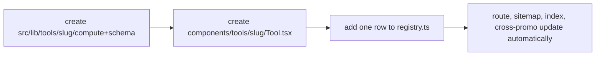

# Architecture Spine — Nirman Media Tools Hub

## Design Paradigm

**Registry-driven feature modules on a static-export shell.** A single pure metadata **registry** enumerates every tool; the app derives all routing, indexing, SEO, and cross-linking from it. Each tool is a self-contained **module** (pure compute + client UI + data) that plugs into one shared **chassis** (`ToolShell`). Adding a tool = add a module folder + one registry row. Nothing else in the app changes.

Layer → directory:

| Layer | Home |
| --- | --- |
| Registry (pure metadata) | `src/lib/tools/registry.ts` |
| Tool modules (compute + data + UI) | `src/lib/tools/<slug>/` + `src/components/tools/<slug>/` |
| Chassis (shell, SEO, shared surface, lead slot, cross-promo) | `src/app/tools/` + `src/components/tools/_shell/` |

## Invariants & Rules

### AD-1 — Static-export shell, no server runtime `[ADOPTED]`
- **Binds:** all
- **Prevents:** a tool adding a Route Handler / Server Action / dynamic rendering that breaks `next build` (`output: "export"`).
- **Rule:** all computation runs client-side; any network call (Phase-2 lead capture) is a browser `fetch` to an **external** endpoint. No server code path is introduced.

### AD-2 — The tool registry is the single source of truth
- **Binds:** routing, `/tools` index, `sitemap.ts`, cross-promo, related-tools
- **Prevents:** orphan tools (live route but missing from sitemap/index), divergent per-tool registration.
- **Rule:** one pure, React-free registry (`ToolMeta[]`). Everything that enumerates tools maps over it. Adding a tool **never** hand-edits routing or `sitemap.ts`.

### AD-3 — One dynamic route renders every tool `[ADOPTED pattern: industries/[slug]]`
- **Binds:** `src/app/tools/[slug]/page.tsx`
- **Prevents:** each tool hand-rolling its own page, SEO block, and layout → inconsistent landing pages.
- **Rule:** `/tools/[slug]` uses `generateStaticParams()` + `generateMetadata()` from the registry, and renders the tool inside the shared `ToolShell` (H1/SEO structure, tool island, explainer + FAQ, result frame, lead slot, cross-promo strip).

### AD-4 — Compute is pure and separate from UI
- **Binds:** every tool module
- **Prevents:** business math tangled inside React → untestable, inconsistent, unverifiable against sources.
- **Rule:** each tool exports a pure deterministic `compute(input): result` (no React, no I/O) + a zod input schema + a client UI component. No calculation logic lives in a component.

### AD-5 — Tool input state is URL-owned
- **Binds:** every tool UI
- **Prevents:** each tool inventing its own share / deep-link / persistence model.
- **Rule:** inputs serialize to query params; the URL is the source of truth; results recompute from parsed inputs. (Enables shareable links under static export — the client reads the query.)

### AD-6 — Region-variable data lives in versioned, date-stamped tables
- **Binds:** area-converter, stamp-duty, and any rate/factor tool
- **Prevents:** scattered magic numbers, wrong regional answers (e.g. bigha ≠ constant), silently stale statutory rates.
- **Rule:** no factor/rate is hardcoded in `compute`; all come from a data module carrying `{ value, asOf, source }`. Region-variable units (bigha/biswa/marla/kanal) require an explicit state selector, Rajasthan default. Rate-sensitive tools surface the `asOf` date in the UI.

### AD-7 — One shared lead-capture contract, flagged off in Phase 1
- **Binds:** all tools, CRM/LMS integration
- **Prevents:** each tool inventing its own capture form and payload → dirty, inconsistent CRM data.
- **Rule:** a single `<LeadSlot toolSlug=…>` component posts one common payload shape to one configurable endpoint. Feature-flagged **off** in Phase 1 (no gate). The endpoint target is deferred; the *payload contract and component* are fixed now.

### AD-8 — Reuse the existing design system
- **Binds:** all tool UI
- **Prevents:** N tools → N visual languages.
- **Rule:** tools use the site's tokens (`cream/navy/gold/ink/line`, `font-heading`, `eyebrow`, `tab-num`) plus one shared tool-surface family (`InputField`, `Slider` synced with a numeric field, `ResultCard`, `Chart`). No per-tool bespoke primitives.

**Dependency direction** (arrows = "may depend on"; never reversed):

```mermaid
graph TD
  registry[tools/registry.ts — pure meta]
  compute[tool compute + data — pure]
  ui[tool UI component — client]
  shell[ToolShell + shared surface]
  route[app/tools/[slug] + sitemap + index]

  route --> registry
  route --> shell
  shell --> ui
  ui --> compute
  ui --> registry
  compute --> data[versioned data tables]
  route -. never .-> compute
```

## Consistency Conventions

| Concern | Convention |
| --- | --- |
| Tool identity | kebab-case `slug`, unique, stable; it is the route, the folder name, and the registry key. |
| Registry shape | `ToolMeta = { slug, title, category, oneLiner, seo:{h1,description,faq[]}, related:slug[], phase }`. Pure data, no React imports. |
| Module layout | `src/lib/tools/<slug>/compute.ts` (pure), `/schema.ts` (zod), `/data.ts` (if region data); UI at `src/components/tools/<slug>/Tool.tsx` (`'use client'`). |
| Number/money format | `en-IN` locale, `₹`, lakh/crore grouping — via one shared formatter util. Never ad-hoc `toLocaleString` per tool. |
| URL state (AD-5) | one shared `useToolState(schema)` helper does parse/serialize/defaults against the zod schema — tools never read/write `searchParams` directly, so encoding stays uniform. |
| Lead payload (AD-7) | fixed shape `{ toolSlug, name, phone, email?, resultSummary: string, capturedAt: ISO }` — every tool feeds `LeadSlot` this and nothing else, so CRM ingest is one schema. |
| Data provenance | statutory/region values carry `{ value, asOf: 'YYYY-MM-DD', source: url }`. |
| SEO | one URL per tool; H1 = search intent; tool above the fold; explainer + FAQ schema below; city/state variants as copy. |
| Next.js APIs | mirror the repo's ratified usage (`generateStaticParams`, async `generateMetadata`, `params: Promise<…>`). **Read `node_modules/next/dist/docs/` before writing code — this Next 16 is customized.** |

## Stack

| Name | Version |
| --- | --- |
| Next.js (App Router, `output: export`) | 16.2.6 |
| React | 19.2.4 |
| TypeScript | 5 |
| Tailwind CSS | 4 |
| zod (input schemas) | 4.4.3 |
| react-hook-form (tool inputs) | 7.75.0 |
| framer-motion / gsap / lenis (existing motion) | 12 / 3 / 1 |

## Structural Seed

```text
src/
  lib/tools/
    registry.ts            # ToolMeta[] + toolBySlug()  (AD-2, pure)
    format.ts              # en-IN money/number formatters
    emi/         compute.ts schema.ts
    area/        compute.ts schema.ts data.ts      # units by state (AD-6)
    stamp-duty/  compute.ts schema.ts data.ts      # RJ rates {asOf,source}
    vastu/       compute.ts schema.ts data.ts      # rule table JSON
  app/tools/
    page.tsx               # hub index — maps registry (AD-2)
    [slug]/page.tsx        # chassis: static params + metadata + ToolShell (AD-3)
  components/tools/
    _shell/ ToolShell.tsx LeadSlot.tsx CrossPromo.tsx   # chassis (AD-7,8)
    _surface/ InputField.tsx Slider.tsx ResultCard.tsx Chart.tsx
    emi/Tool.tsx  area/Tool.tsx  stamp-duty/Tool.tsx  vastu/Tool.tsx
  app/sitemap.ts           # +…registry.map (AD-2)  ← the one existing file tools touch
```

Add-a-tool lifecycle:



## Capability → Architecture Map

| Capability | Lives in | Governed by |
| --- | --- | --- |
| Tool catalog / hub index | `lib/tools/registry.ts`, `app/tools/page.tsx` | AD-2 |
| Per-tool SEO landing page | `app/tools/[slug]/page.tsx` + `ToolShell` | AD-3, conventions |
| EMI / area / stamp-duty / vastu math | `lib/tools/<slug>/compute.ts` | AD-4, AD-6 |
| Shareable results | query-param state | AD-5 |
| Lead capture (Phase 2) | `LeadSlot` + submit contract | AD-7, AD-1 |
| Cross-promo CRM/LMS + broker tools | `CrossPromo` in `ToolShell` | AD-3, AD-8 |

## Deferred

- **Lead-capture endpoint (Phase 2).** Static export has no server; the browser must POST somewhere. Options: existing CRM/LMS API, a serverless function, or a form service. Contract (payload + `LeadSlot`) is fixed by AD-7 now; the *target* is chosen when Phase 2 starts. `[ASSUMPTION]` CRM/LMS exposes an ingest endpoint or webhook.
- **Paid-AI tools** (floor-plan photo → vastu). Out of v1 by the brief; would introduce the first non-static dependency — revisit the AD-1 boundary when funded.
- **Hosting/CI target.** `out/` static bundle deploys to any static host; concrete host + deploy pipeline not owned at this altitude. `[ASSUMPTION]` static hosting (Vercel/Netlify/Cloudflare Pages/GoDaddy static).
- **Testing strategy for `compute()`.** AD-4 makes tools unit-testable; the runner/coverage bar is a build-phase decision, not an invariant.
- **i18n (Hindi).** Not in v1 scope; registry/copy shape does not preclude it later.
